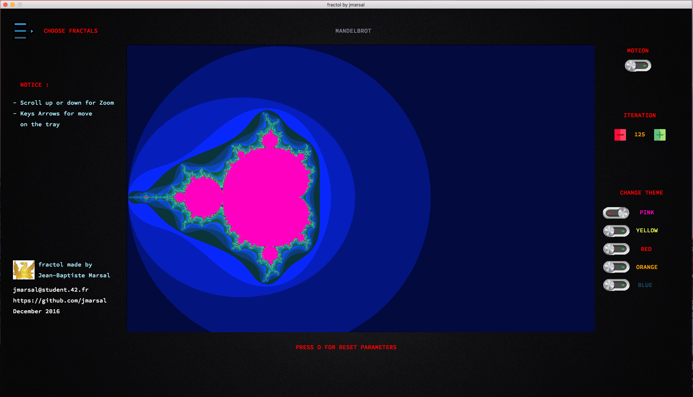
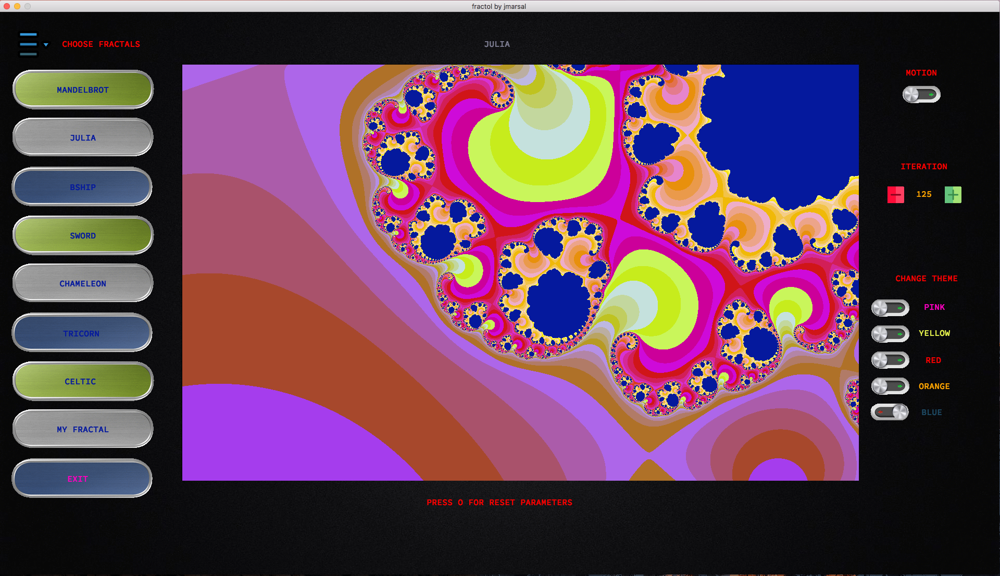

## Contributeur
[@jmarsal](https://github.com/jmarsal)

## Note Finale
**118 / 100**

# Projet Fractol 42
Ce projet consiste à créer un petit logiciel d’exploration fractale. Commencez donc
par voir ce qu’est une fractale.
Les contraintes sont les suivantes :
• Votre logiciel doit proposer au minimum 3 types de fractales différentes, dont au
moins l’ensemble de Julia et l’ensemble de Mandelbrot (soit au moins une troisième
fractale au choix).
• Il doit etre possible de faire varier avec la souris (sans clic) le paramètre de l’ensemble
de Julia. Pour les autres types de fractale, cela est laissé à votre discrétion.
• La molette de la souris permet de zoomer et dézoomer sur la position actuelle de
la souris, et cela de façon quasi infinie (modulo les limites de la machine). C’est
dans le principe même des fractales.
• Il doit y avoir un jeu de couleur minimum pour ressentir la profondeur de chaque
fractale. Mieux : lâchez-vous sur les effets psychédéliques.
• Un paramètre est passé en ligne de commande pour définir quel type de fractale
est à afficher. Si il n’y a pas de paramètre fourni, ou si le paramètre est invalide,
le programme affiche la liste des paramètres disponibles et quitte.
En ce qui concerne la représentation graphique :
• Vous devez utiliser la minilibX, dans sa version pour XQuartz installée par défaut
sur les dump, ou bien dans sa version native pour MacOS X.
• Vous devrez gérer l’expose correctement.
• La touche ESC permettra de quitter le programme.
• L’utilisation des images de la minilibX est fortement conseillée.

## Manuel
1. `make`
2. `./fractol [fractal]`
3. Si besoin d'aide `./fractol [help]`

